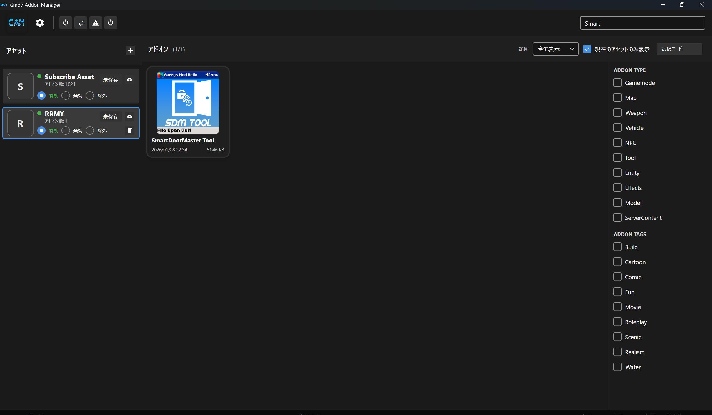

# GAM (Gmod Addon Manager)

[](https://www.gnu.org/licenses/gpl-3.0)
[](https://dotnet.microsoft.com/download/dotnet/6.0)
[](https://avaloniaui.net/)



GAM は Garry's Mod のアドオンを「アセット（プロファイル）」単位で管理する Windows アプリです。
ソフト無効化（`addonnomount.txt`）を中心に、アドオンの整理・切り替えを素早く行えます。

## 特徴
- アセット（プロファイル）単位でアドオンを整理・切り替え
- アドオンの有効/無効/除外をワンクリックで変更（ソフト方式）
- `.gam` から一括インポート
- サムネイル、タグ、サイズ、メモの表示
- 変更履歴の Undo（取り消し）
- アセット画像の設定とトリミング
- アセットのバージョン保存/復元
- フィルタ/検索で目的のアドオンを素早く探せる

## 無効化の仕組み
- 現行リリースは **ソフト無効化のみ** です。
- Garry's Mod の `garrysmod/cfg/addonnomount.txt` を更新して無効化します。
- ジャンクション/ハードリンク系は legacy/experimental 扱いで、現行リリースでは前提にしません。

## インポート/追加方法
- `.gam` ファイルを読み込み
- 既存アドオン一覧から選択して追加
- Workshop コレクション URL/ID の直接読み込みは現行リリースでは無効です。

## 使い方（クイックスタート）
1. 起動してアセットを作成
2. `.gam` を読み込み
3. アドオンを追加し、アセットを適用
4. 必要に応じてメモや画像を設定

## 動作環境
- Windows 10/11 (64-bit)
- .NET 6 Desktop Runtime
- Visual C++ 2015-2022 x64

## インストール
- 初期リリース後は GitHub Releases から入手予定
- 例: `GAM-Setup-X.Y.Z.exe` / `GAM-Portable-X.Y.Z.zip`

## データ保存場所
- 設定: `%APPDATA%\GmodAddonManager\settings.json`
- ログ: `%APPDATA%\GmodAddonManager\logs\`
- 更新チェック記録: `%APPDATA%\GmodAddonManager\last_update_check.txt`

## 更新チェック
- GitHub Releases を参照して更新を検出します（デフォルトは `RiRi-380/GAM`）。
- 更新元リポジトリは環境変数で変更できます。
- 詳細は `docs/UPDATE_CHECK.md` を参照してください。

## 注意事項
- アドオンの購読管理は Steam クライアントで行います。
- Steamworks DLL (`steam_api64.dll`, `steam_appid.txt`) は同梱しません。

## 開発
```powershell
dotnet restore
dotnet build src/GmodAddonManager.UI/GmodAddonManager.UI.csproj -c Debug
dotnet test
dotnet run --project src/GmodAddonManager.UI/GmodAddonManager.UI.csproj
```

## ビルド（リリース用）
```powershell
./build-release.ps1 -Version vX.Y.Z
```

## 構成
```
GAM/
  src/GmodAddonManager.Core/   # Core logic
  src/GmodAddonManager.UI/     # Avalonia UI
  installer/                   # Inno Setup
  scripts/                     # Release helpers
  docs/                        # Docs
```

## ライセンス
GNU General Public License v3.0 - see `LICENSE`

## コントリビュート
Issue / Pull Request を歓迎します。
